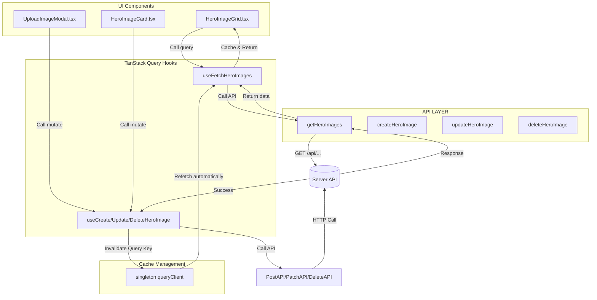

# Hero Images Feature Implementation Guide

This document describes the implementation architecture for the **Hero Images** feature, which serves as the standard template/guideline for folder structure and flow of operations across all features in this project.

---

## Directory Structure

All files related to the `hero-images` feature are self-contained within the `src/features/hero-images` directory, organized by concern:

```text
src/features/hero-images/
├── api/
│   └── heroImages.ts          # Raw Axios network request functions
├── hook/
│   └── heroImageHooks.ts      # TanStack Query (Query & Mutation) hooks
├── types/
│   └── types.ts               # Feature-specific TypeScript declarations
├── HeroImageCard.tsx          # Card item component (with action triggers)
├── HeroImageGrid.tsx          # Feature container component (fetch list & toolbar)
└── UploadImageModal.tsx       # Create/Upload form modal component
```

---

## Architecture Flow

The feature follows a unidirectional data and mutation flow:



---

## Technical Details by Layer

### 1. Types Layer (`types/types.ts`)
Declares TypeScript interfaces representing the feature models:
* Example: [SerializedHeroImage](file:///c:/Users/munna/Desktop/batch-15/src/features/hero-images/types/types.ts#L1) defines all backend fields.

### 2. API Layer (`api/heroImages.ts`)
Contains raw backend requests using the global [axios](file:///c:/Users/munna/Desktop/batch-15/src/lib/http/axiosInstance.ts) client:
* Functions: `getHeroImages()`, `createHeroImage()`, `updateHeroImage()`, and `deleteHeroImage()`.
* Responsibility: Makes HTTP requests, handles parsing/unwrapping, and throws descriptive errors on failures.

### 3. Hooks Layer (`hook/heroImageHooks.ts`)
Integrates the API functions with **TanStack Query** (`useQuery` and `useMutation`):
* **Queries**: Wrap read calls (`useFetchHeroImages`).
* **Mutations**: Wrap write/destructive operations (`useCreateHeroImage`, `useUpdateHeroImage`, `useDeleteHeroImage`).
* **Cache Invalidation**: On successful mutation, the hook imports the global singleton `queryClient` from `@/lib/queryClient` and calls `queryClient.invalidateQueries(...)` with the appropriate query keys (e.g. `["hero-images"]`) to ensure the UI stays updated.

### 4. Components Layer
* **Container Component (`HeroImageGrid.tsx`)**: Calls query hook to fetch list, manages loading/error feedback, and renders subcomponents.
* **Presentational & Action Components (`HeroImageCard.tsx`, `UploadImageModal.tsx`)**: Collect input/actions and fire mutation hooks (`mutateAsync`), handling loading state locally via TanStack Query's `isPending` properties.

---

## Guidelines for Creating New Features

When implementing a new feature in the codebase:
1. **Self-Containment**: Keep all UI components, custom hooks, network operations, and types under the same feature directory under `src/features/<feature-name>`.
2. **Encapsulate Hook Mutations**: Always perform query key invalidation inside the hook's `onSuccess` block rather than inside components.
3. **Use the Singleton `queryClient`**: Import and invoke invalidation through `queryClient` from `@/lib/queryClient`.
4. **API Errors**: Ensure functions in `api/` throw robust `Error` objects so that mutation hooks can catch them and supply readable error strings to component alert banners.
